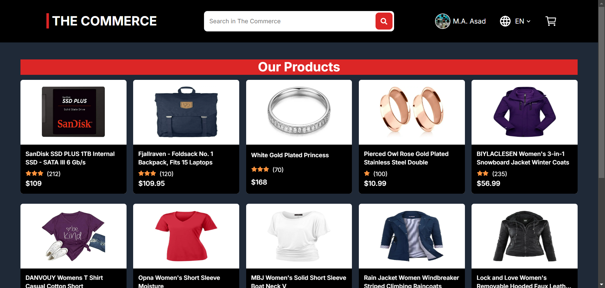
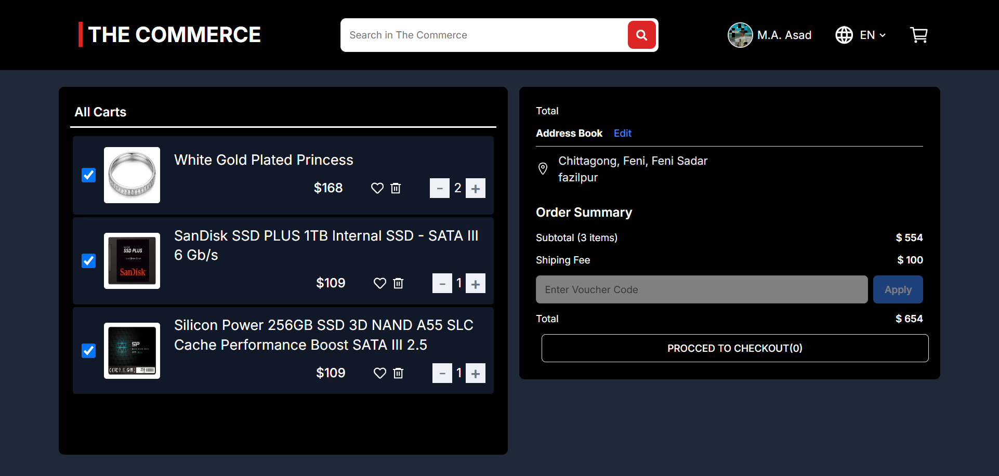
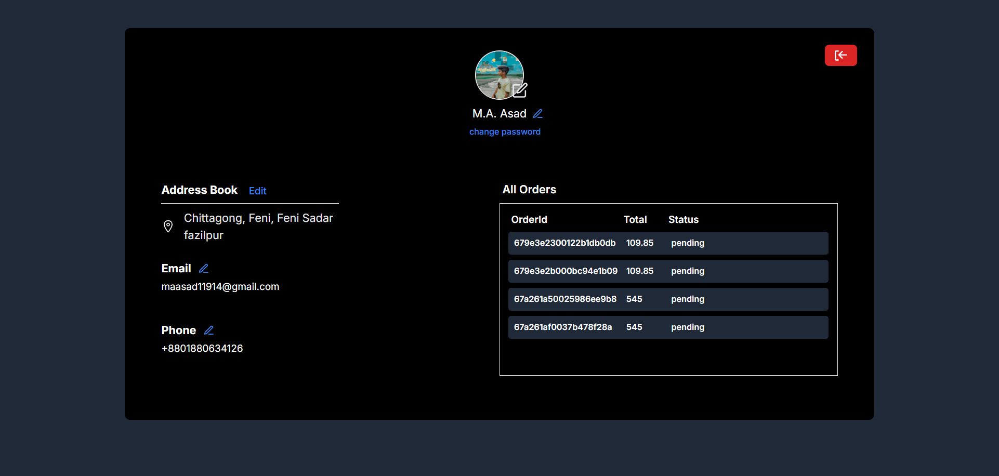
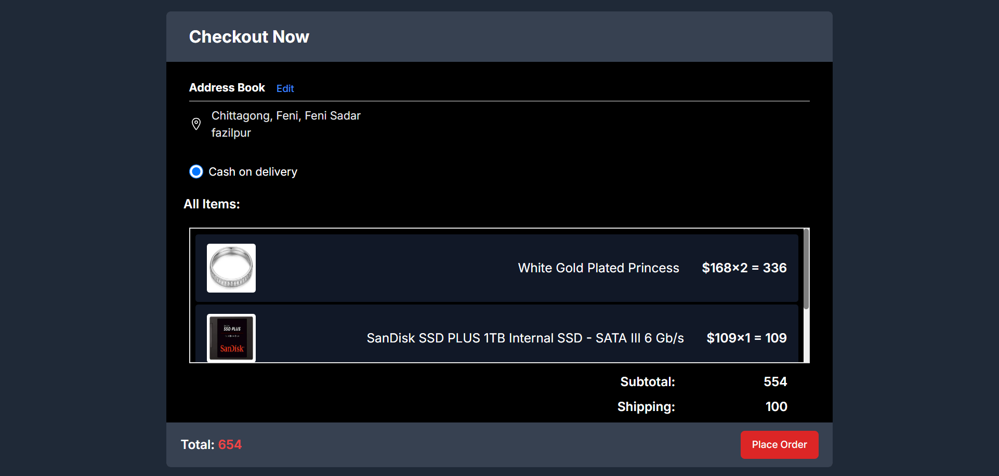
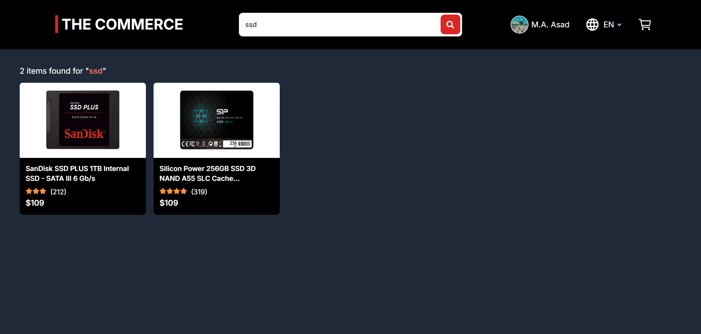

<h1>The Commerce</h1>

This is a production ready Responsive Multi-functional E-Commerce site.

Go Live: https://the-commerce.onrender.com

<h3>Key Features</h3>

1. Customizable profile page (Change Avatar,Email, Password etc.)

2. Authentication,database,storage management using appwrite.

3. Search Engine optimization (sitemap, robots, metadata etc.)

4. Performance optimization using Next js server side rendering (SSR)

5. Managing global states using Redux Toolkit
 
<h3>Pages</h3>

6. Home page

7. Product page

8. Profile page

9. Search page

10. Cart page

11. Cheackout page
     
     
    
    
     
     
     
    
    
